# Computer Aided Manufacturing

Computer Aided Manufacturing is the use of software and computer controlled machinery to automate manufacturing.

If you want to bring your design to life with a high accuracy finish, then CAM is the way to go. 

We are going to make a CAD file and from a tubular billet machine the following workpiece.

<!--This is how our billet will look like-->

For machining we require a 2D design of our part.

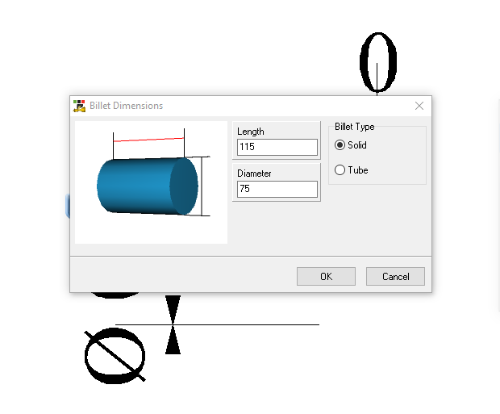\
Billet dimensions

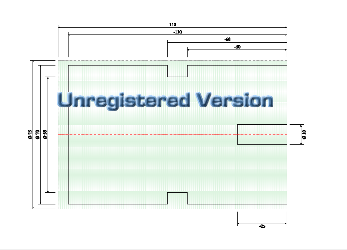\
Our final design

Generating a CAM wizard is our first CAM operation

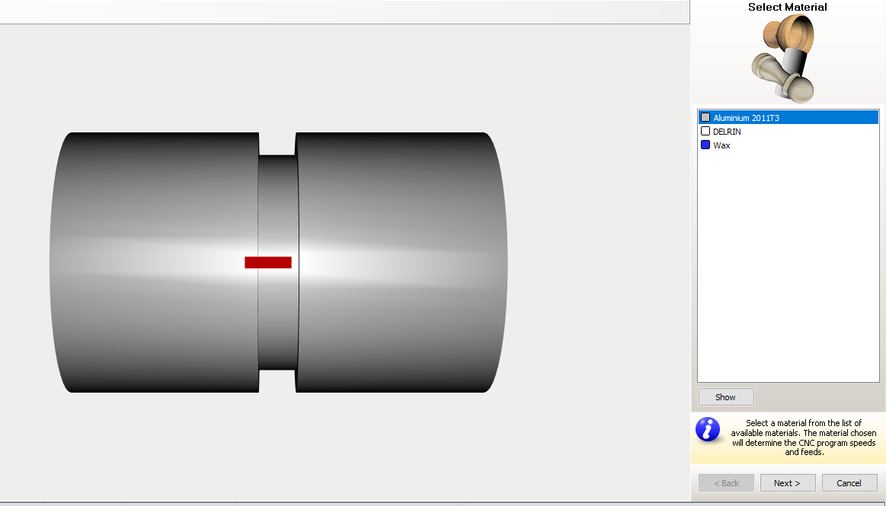\
Material Selection

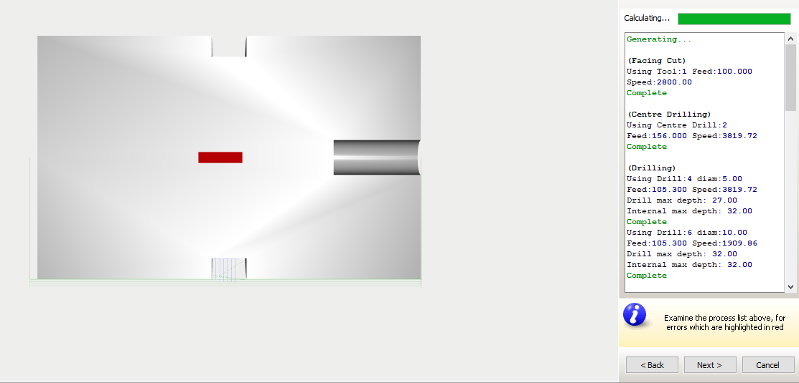\
Toolpath Generation

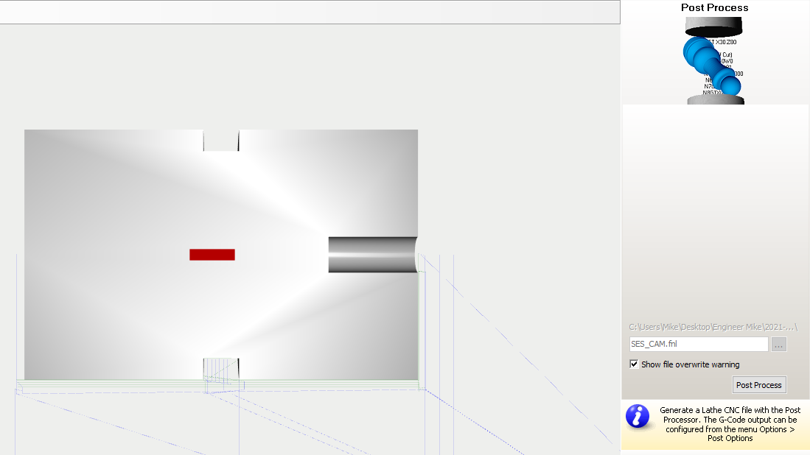\
Postprocess - G and M codes generation
\
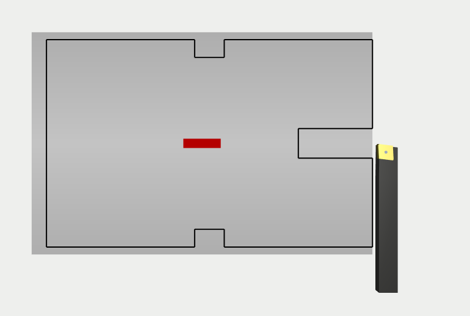\
Facing operation

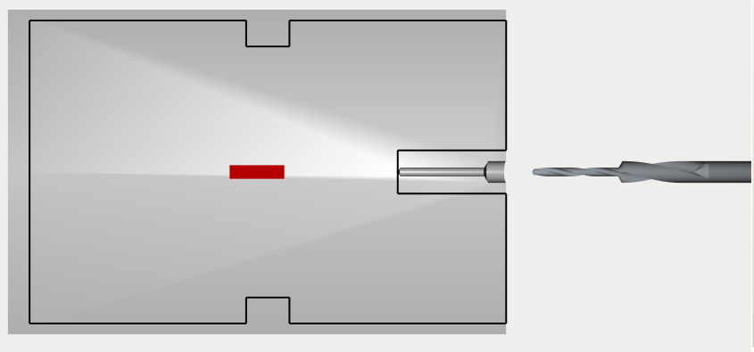\
Centre Drilling

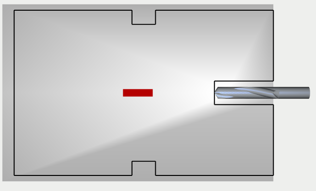\
Intermidiate drilling operation

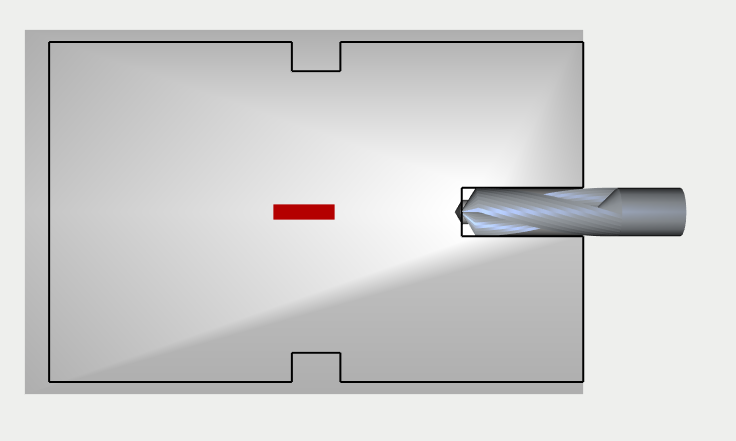\
FInal Drilling 
  
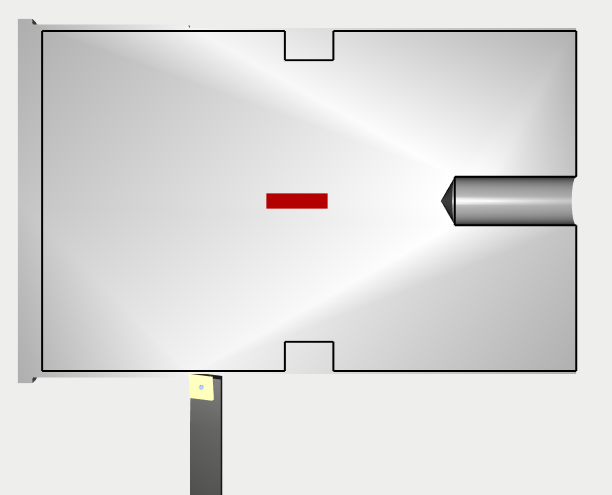\
Turning operation

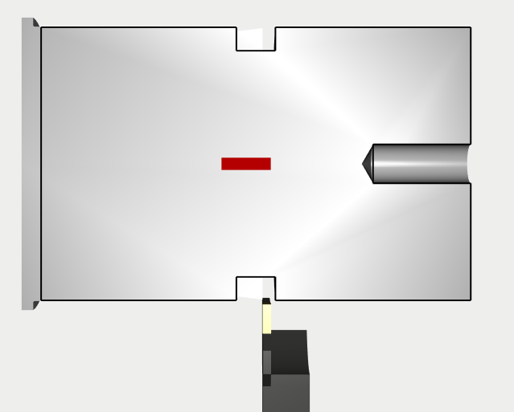\
Grooving operation
  

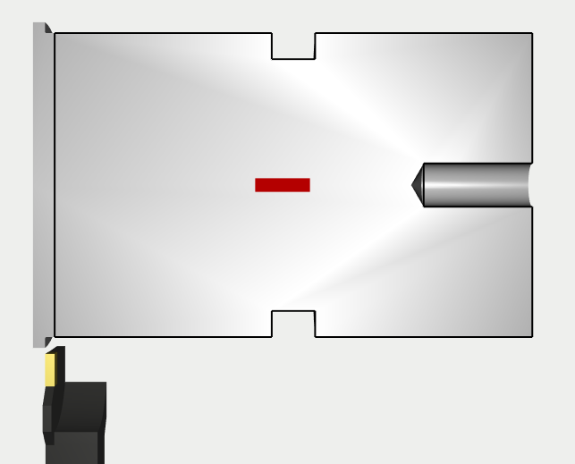\
Parting off operation

