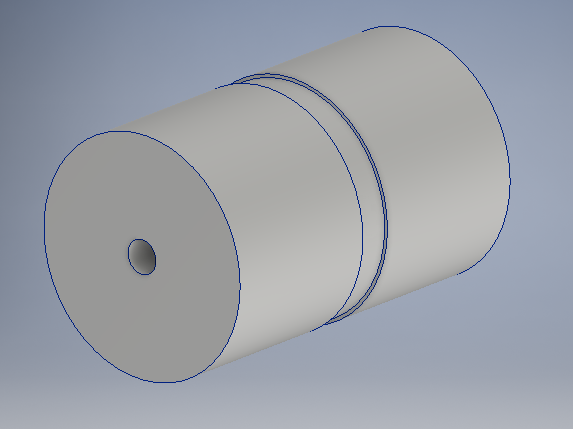

# Computer Aided Manufacturing

Computer Aided Manufacturing is the use of software and computer controlled machinery to automate manufacturing.

If you want to bring your design to life with a high accuracy finish, then CAM is the way to go. 

We are going to make a CAD file and from a tubular billet machine the following workpiece.

This is how our billet will look like

For machining we require a 2D design of our part.

In the CAD software we set our billet dimensions

Billet appearance in the CAD software

